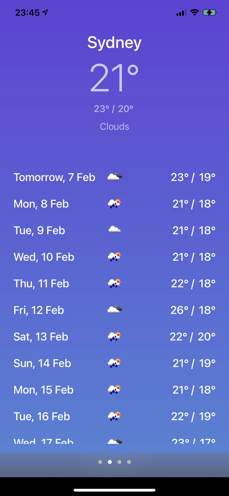

## Requirements

- iOS 13.0+
- Xcode 12+
- Swift 5.2+

## Setup

1. Download the source code or clone the repository.
2. Run the project.
3. SPM will automatically download all the required 3rd party libraies

## Screenshot

## Introduction

This is a simple app that's used to fetch user's current location data and the following 15 days' weather data, the real time location data will be refreshed every minute, so to make sure user will always get the most recent weather data.

The app consists of a page view controller with four child view controllers, first view controller displays user's local weather data, the next three pages display Sydney, Perth and Hobart's weather data. User is able to swipe the screen to navigate between differen pages. Everytime the view appears, the weather data will be refreshed.

The app uses two 3rd party library, Alamofire is used to consume openweathermap API, Promisekit is used to get multiple API calls organised, make the code cleaner and easy to debug.

The app has a MVVM architecture, the ServiceManager is responsible for making the API call, get the raw data ready, then the viewModel will take care of the raw data, load them into user friendly CellModels, then use closure to inform view controller to load the sanitized data. Loading indicator will only animate when the data array is empty, next time it won't appear to overlap the content.

## Frameworks

- [Alamofire](https://github.com/Alamofire/Alamofire)
- [PromiseKit](https://github.com/mxcl/PromiseKit)

